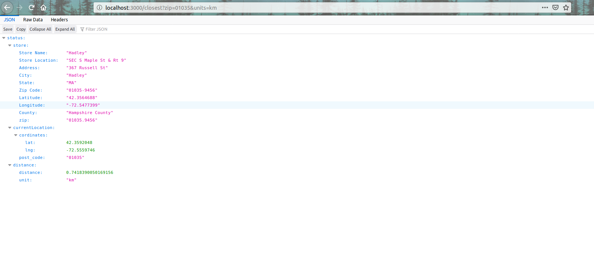

# Nearest Store Location

A simple NodeJs application that accepts a zipcode or address as query string then return a store from a given dataset closer to it.

check the `/task/README.md` to view the original task.

## Technologies
1. Nodejs
2. Mocha
3. Typescript
4. TsLint
5. Google GeoLocation

## Algorithm
After getting a postal code from a given zip/address via google geolocation API, we need to get the closest zip number from our dataset.

Firstly all compound zip code such as 64503-9458 inside our dataset are converted into 64503.3458 so that we can perfom mathematical operation on it.

Searching for a closest store to a give zip leads me to linear search of the whole dataset array which is `O(n)`.

I solve this by sorting the converted dataset zipcodes, then perfom a binary search `O( log N)` which is faster compare to `O (n)`.

##  Setup & Installation
- Clone the repository into a directory of your choice
- Open your Terminal and run `git clone https://github.com/princesegzy01/nearest-store-location.git`
- change directory to the app you cloned buy running `cd nearest-store-location`
- Install dependencies by running `npm install` on your terminal.

## Start Server
- From your terminal, run  `npm run ts-watch` to watch changes to typescripts file and automatically transpile it to javascripts.

- open another terminal and run `npm start` to start the server.

## Open Application
- Open your browser and logon to [`http://localhost:3000/closest?zip=01035&units=km`](http://localhost:3000/closest?zip=01035&units=km) to get closest store to zip code, or use this [`http://localhost:3000/closest?address=1600 Amphitheatre Parkway in Mountain View, California, United States&units=km`](http://localhost:3000/closest?address=1600%20Amphitheatre%20Parkway%20in%20Mountain%20View,%20California,%20United%20States&units=km) to search by address. you should see a page like below.

    

## Parameters to supply
GET `/closest` is the route called to retrieve the closest store. However there are some compulsory querystring parameters that is needed to be pass along with the query.

- `zip`: (String) The caller of this endpoint needs to supply a valid zip code e.g *01035* to sucessfully query this endpoint.

    OR

- `address` (String): This is a  human readable address that e.g *1600 Amphitheatre Parkway in Mountain View, California, United States* that can be passed along with the request as against zip codes

- `units` (String) : This is the unit of measurement you want to get the distance in. parameter must be either `mi` (default) or `km`.

## Result

Below is a sample result of a successful query and the json output contains 3 nodes:
1. **store** : This is the closest store retrieved from the dataset.
2. **currentLocation** : This is the cordinates of the given zip code or address.
3. **distance**: This return the calculated distance between the store and the current loacation node.

        {
            "status": {
                "store": {
                    "Store Name": "Mountain View",
                    "Store Location": "NEC Showers Dr & Latham St",
                    "Address": "555 Showers Dr",
                    "City": "Mountain View",
                    "State": "CA",
                    "Zip Code": "94040-1432",
                    "Latitude": "37.4010106",
                    "Longitude": "-122.1060628",
                    "County": "Santa Clara County",
                    "zip": "94040.1432"
                },
                "currentLocation": {
                    "cordinates": {
                        "lat": 37.4234118,
                        "lng": -122.0794404
                    },
                    "post_code": "94043"
                },
                "distance": {
                    "distance": 3.4252122569651604,
                "   unit": "km"
                }
            }
        }	
    
## Test

The test for this application are written using the following tech nologies : Mocha, Chai and Supertest.

To run the test, open your Terminal, cd into the project root and run  `npm test`.

## Reference
1. (Distance Calculation)  https://www.geodatasource.com/developers/javascript

Feel free to reach out to me if you have any questions at princesegzy01@gmail.com